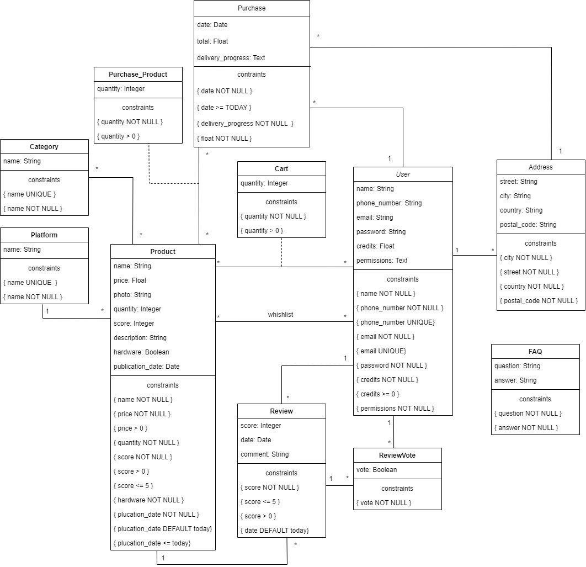

# EDB: Database Specification Component

## A4: Conceptual Data Model

The Conceptual Data Model contains the identification and description of the entities and relationships that are relevant to the database specification. Therefore, a UML class diagram is used to represent the information.

### 1. Class diagram

The UML diagram in Figure 1 shows the main entities, their relationships, attributes and domains. The multiplicity of relationships are present too.



<figcaption align= "center">Figure 1: UML Class Diagram</figcaption></p>

### 2. Additional Business Rules

Additional business rules or restrictions are described in text as UML notes in the diagram or as independent notes in this section.

| Identifier | Description |
|-----------------|--------------------------|
| BR01 | The total value of a purchase must be the sum of price of the purchased products. |
| BR02 | Update products' score according to all existing reviews. |
| BR03 | A user can only review a product that he has purchased. |
| BR05 | A product must have its category's required properties filled in. |
| BR06 | If the administrator removes a product, it will be removed from every cart and wishlist. |
| BR07 | A purchase's address must have to be in the user's addresses book. |


---


## A5: Relational Schema, validation and schema refinement

This artifact contains the Relational Schema obtained from the Conceptual Data Model.

### 1. Relational Schema

The Relational Schema includes the relation schemas, attributes, domains, primary keys, foreign keys and other integrity rules: UNIQUE, DEFAULT, NOT NULL, CHECK.  
Relation schemas are specified using a textual compact notation. 


| Relation reference | Relation Compact Notation                        |
| ------------------ | ------------------------------------------------ |
| R01                | users (<u>id</u>, name __NN__, phone_number __UK__ __NN__, email __UK__ __NN__, password __NN__, credits __NN__, permissions __NN__)                    |
| R02                | addresses (<u>id</u>, street __NN__, city __NN__, country __NN__, postal_code __NN__, <u>id_user</u> -> users) |
| R03                | platform (<u>id</u>, name __NN__ __UK__) |
| R04                | category (<u>id</u>, name __NN__ __UK__) |
| R05                | product (<u>id</u>, name __NN__, price __NN__ __CK__ price > 0, photo, score __NN__ __CK__ score > 0 and score <= 5, description __NN__, hardware __NN__, publication_date __NN__ __CK__ publication_date <= Today __DF__ Today, id_platform -> platform) |
| R06                | category_product (<u>id_category</u> -> category, <u>id_product</u> -> product) |
| R07                | review (<u>id</u>, id_product -> product, id_user -> users, score __NN__ __CK__ score > 0 and score <= 5, date __DF__ Today, comment) |
| R08                | review_vote (<u>id</u>, id_review -> review, id_user -> users, vote __NN__) |
| R09                | cart (<u>id_product</u> -> product, <u>id_user</u> -> users, quantity __NN__ __CK__ quantity > 0) |
| R10                | wishlist (<u>id_product</u> -> product, <u>id_user</u> -> users) |
| R11                | purchase (<u>id</u>, id_user -> users, date __NN__ __DF__ Today, total __NN__ __CK__ total > 0, deliveryProgress, id_address -> addresses) |
| R12                | purchase_product (<u>id_purchase</u> -> purchase, <u>id_product</u> -> product, quantity __NN__ __CK__ quantity > 0)
| R13                | faq (<u>id</u>, question __NN__, answer __NN__) |

Legend:

* UK = UNIQUE KEY
* NN = NOT NULL
* DF = DEFAULT
* CK = CHECK

### 2. Domains

Specification of additional domains:

| Domain Name | Domain Specification           |
| ----------- | ------------------------------ |
| deliveryProgress  | ENUM ('Processing', 'Shipped', 'Delivered') |
| userPermission    | ENUM ('User', 'Admin') |

### 3. Schema validation

To validate the Relational Schema obtained from the Conceptual Data Model, all functional dependencies are identified and the normalization of all relation schemas is accomplished. 

| **TABLE R01**   | user                                                            |
| --------------  | ---                                                             |
| **Keys**        | { id }, { email }, {phoneNumber}                                |
| **Functional Dependencies:**                                                      |         
| FD0101          | id → {name, phoneNumber, email, password, credits, permissions} |
| FD0102          | email → {id, name, phoneNumber, password, credits, permissions} |
| FD0103          | phoneNumber → {id, name, email, password, credits, permissions} |
| **NORMAL FORM** | BCNF                                                            |

| **TABLE R02** | address                                            |
| ------------- | -------                                            |
| **Keys**      | {id}                                               |
| **Functional Dependencies:**                                       |
| FD0201        | id -> {id_user, street, city, country, postalCode} |
| **NORMAL FORM** | BCNF                                             | 


| **TABLE R03**   | platform           |
| --------------  | ---                |
| **Keys**        | { id }, { name }   |
| **Functional Dependencies:**         |
| FD0401          | id → { name }      |
| FD0401          | name → { id }      |
| **NORMAL FORM** | BCNF               |

| **TABLE R04**   | category           |
| --------------  | ---                |
| **Keys**        | { id }, { name }   |
| **Functional Dependencies:**         |
| FD0501          | id → { name }      |
| FD0501          | name → { id }      |
| **NORMAL FORM** | BCNF               |

| **TABLE R05**   | product                                                                                  |
| --------------  | ---                                                                                      |
| **Keys**        | { id }                                                                                   |
| **Functional Dependencies:**                                                                               |
| FD0301          | id → { name, price, photo, score, description, hardware, publication_date, id_platform } |
| **NORMAL FORM** | BCNF                                                                                     |

| **TABLE R06**   | categoryProduct             |
| --------------  | ---                         |
| **Keys**        | { id_category, id_product } |
| **Functional Dependencies:** | none           |
| **NORMAL FORM** | BCNF                        |

| **TABLE R07**   | review                                             |
| --------------  | ---                                                |
| **Keys**        | { id }                                             |
| **Functional Dependencies:**                                         |
| FD0701          | id → { id_product, id_user, score, date, comment } |
| **NORMAL FORM** | BCNF                                               |

| **TABLE R08**   | reviewVote                        |
| --------------  | ---                               |
| **Keys**        | { id }                            |
| **Functional Dependencies:**                        |
| FD0801          | id → { id_review, id_user, vote } |
| **NORMAL FORM** | BCNF                              |

| **TABLE R09**   | cart                               |
| --------------  | ---                                |
| **Keys**        | { id_product, id_user }            |
| **Functional Dependencies:**                         |
| FD0901          | id_product, id_user → { quantity } |
| **NORMAL FORM** | BCNF                               |

| **TABLE 10** | wishlist               |
| ------------- | -------               |
| **Keys**      | {id_product, id_user} |
| **Functional Dependencies:** | none   |
| **NORMAL FORM** | BCNF                |

| **TABLE R11** | purchase |
| ------------- | ------- |
| **Keys**      | {id}    |
| **Functional Dependencies:** |
| FD1101        | id -> {id_user, date, total, deliveryProgress, id_address} |
| **NORMAL FORM** | BCNF |

|**TABLE R12**  | purchase_product |
| ------------- | ---------------  | 
| **Keys** | {id_purchase, id_product } |
| **Functional Dependencies:**          |
| FD1201   |  id_purchase, id_product -> { quantity } |
| **NORMAL FORM** | BCNF    |

| **TABLE R13** | faq |
| ------------- | ------- |
| **Keys**      | {id}    |
| **Functional Dependencies:** |
| FD1301        | id -> {question, answer} |
| **NORMAL FORM** | BCNF |

Given that all the relations are in the Boyce-Codd Normal Form (BCNF), the relational schema is also in the BCNF. Therefore, the schema does not need to be further normalised.  

---


## A6: Indexes, triggers, transactions and database population

This artefact contains the physical schema of the database, the identification and characterisation of the indexes, the support of data integrity rules with triggers and the definition of the database user-defined functions. This artefact also contains the database's workload as well as the complete database creation script, including all SQL necessary to define all integrity constraints, indexes and triggers.

### 1. Database Workload

| **Relation reference** | **Relation Name** | **Order of magnitude** | **Estimated growth** |
| ------------------ | ------------- | ------------------------- | -------- |
| RS01                | Platform        | tens | units per year |
| RS02                | Category        | dozens | units per year |
| RS03                | Cart        | thousands | hundreds per day |
| RS04                | Product        | thousands | tens per day |
| RS05                | Review        | thousands | tens per day |
| RS06                | ReviewVote        | thousands | tens per day |
| RS07                | User        | thousands | dozens per day |
| RS08                | Address        | thousands | units per day |
| RS09                | FAQ        | tens | units per year |
| RS10                | Wishlist        | thousands | hundreds per day |
| RS11                | Purchase        | thousands | dozens per day |


### 2. Proposed Indexes

We used indexes to increase the database performance by letting it to find specific rows faster. An index defined on a column that is part of a join condition can also speed up queries that make use of join.

#### 2.1. Performance Indexes
 
There are some queries that are expected to take a long time to execute. Using performance indexes, the performance of a select query can be improved in exchange for an increased execution time of update, delete and insert kind of operations. Despite that, some of the tables can benefit from increased speed in searches.

| **Index**           | IDX01                                  |
| ---                 | ---                                    |
| **Relation**        | product                                |
| **Attribute**       | price                                  |
| **Type**            | B-tree                                 |
| **Cardinality**     | high                                   |
| **Clustering**      | yes                                    |
| **Justification**   | To allow searching for products that have their price lower than a certain value faster. B-tree and clustering to maintain the data sorted and to allow for quick range queries. | 
| `SQL code`                                                  ||

```sql
CREATE INDEX price_products ON product USING btree (price);
```                                                  

| **Index**           | IDX02                                  |
| ---                 | ---                                    |
| **Relation**        | review                                 |
| **Attribute**       | id_product                             |
| **Type**            | hash                                   |
| **Cardinality**     | medium                                 |
| **Clustering**      | yes                                    |
| **Justification**   | To expedite the retrieval of product reviews based on the associated id_product. A hash index is selected to optimize the lookup speed for specific product reviews.                 |
| `SQL code`                                                  ||

```sql
CREATE INDEX product_reviews ON review USING hash (id_product);     
```                                                 


#### 2.2. Full-text Search Indices 

| **Index**           | IDX03 |
| ---                 | --- |
| **Relation**        | product |
| **Attribute**       | name, description, platform |
| **Type**            | GIN              |
| **Clustering**      | No                |
| **Justification**   | To look for products based on matching titles or words in the descritpion. The indexed types are not expected to change often so GIN type is used   |


```sql
-- Add column to product to store computed ts_vectors.
ALTER TABLE product
ADD COLUMN tsvectors TSVECTOR;

-- Create a function to automatically update ts_vectors.
CREATE FUNCTION product_search_update() RETURNS TRIGGER AS $$
BEGIN
 IF TG_OP = 'INSERT' THEN
        NEW.tsvectors = (
         setweight(to_tsvector('english', NEW.name), 'A') ||
         setweight(to_tsvector('english', NEW.description), 'B')
        );
 END IF;
 IF TG_OP = 'UPDATE' THEN
         IF (NEW.name <> OLD.name OR NEW.description <> OLD.description) THEN
           NEW.tsvectors = (
             setweight(to_tsvector('english', NEW.name), 'A') ||
             setweight(to_tsvector('english', NEW.description), 'B')
           );
         END IF;
 END IF;
 RETURN NEW;
END $$
LANGUAGE plpgsql;

-- Create a trigger before insert or update on product.
CREATE TRIGGER product_search_update
 BEFORE INSERT OR UPDATE ON product
 FOR EACH ROW
 EXECUTE PROCEDURE product_search_update();


-- Finally, create a GIN index for ts_vectors.
CREATE INDEX search_idx ON product USING GIN (tsvectors);
```

### 3. Triggers

| **Trigger**     | TRIGGER01                                                     |
| ---             | ---                                                           |
| **Description** | A product's score is updated everytime a review is submitted. |
| **SQL code**                                                                    |
```sql
CREATE OR REPLACE FUNCTION update_product_score() 
RETURNS TRIGGER 
AS
$BODY$
BEGIN
    UPDATE product 
    SET score = (SELECT AVG(score) FROM review WHERE id_product = NEW.id_product) 
    WHERE id = NEW.id_product;
    RETURN NEW;
END;
$BODY$
LANGUAGE plpgsql;

CREATE TRIGGER update_score 
AFTER INSERT OR UPDATE OR DELETE 
ON review
FOR EACH ROW
EXECUTE PROCEDURE update_product_score();
```

| **Trigger**     | TRIGGER02                                                            |
| ---             | ---                                                                  |
| **Description** | After a purchase is made, decrease the stock of all bought products. |
| **SQL code**                                                                           |
```sql
CREATE OR REPLACE FUNCTION update_stock() 
RETURNS TRIGGER 
AS
$BODY$
BEGIN
    UPDATE product
    SET quantity = quantity - NEW.quantity 
    WHERE id = NEW.id_product;
    RETURN NEW;
END;
$BODY$
LANGUAGE plpgsql;

CREATE TRIGGER update_stock 
AFTER INSERT 
ON purchase_product
FOR EACH ROW
EXECUTE PROCEDURE update_stock();
```

| **Trigger**     | TRIGGER03                                                                         |
| ---             | ---                                                                               |
| **Description** | A product can't be added to the cart in a quantity higher than the current stock. |
| **SQL code**                                                                                        |
```sql
CREATE OR REPLACE FUNCTION check_cart_quantity() 
RETURNS TRIGGER 
AS
$BODY$
BEGIN
    IF NOT EXISTS (SELECT quantity FROM product WHERE id = NEW.id_product AND quantity >= NEW.quantity) THEN
        RAISE EXCEPTION 'Not enough items of %', NEW.id_product;
    END IF;
    RETURN NEW;
END;
$BODY$
LANGUAGE plpgsql;

CREATE TRIGGER check_valid_cart 
BEFORE INSERT 
ON cart
FOR EACH ROW
EXECUTE PROCEDURE check_cart_quantity();
```

| **Trigger**     | TRIGGER04                                     |
| ---             | ---                                           |
| **Description** | The cart is cleared after a purchase is made. |
| **SQL code**                                                    |
```sql
CREATE OR REPLACE FUNCTION clear_cart() 
RETURNS TRIGGER 
AS
$BODY$
BEGIN
    DELETE FROM cart
    WHERE id_user = NEW.id_user;
    RETURN NEW;
END;
$BODY$
LANGUAGE plpgsql;

CREATE TRIGGER clear_cart 
AFTER INSERT 
ON purchase
FOR EACH ROW 
EXECUTE PROCEDURE clear_cart();
```

| **Trigger**     | TRIGGER04                                                                   |
| ---             | ---                                                                         |
| **Description** | After a purchase, all bought products are removed from the user's wishlist. |
| **SQL code**                                                                                  |
```sql
CREATE OR REPLACE FUNCTION clear_wishlist() 
RETURNS TRIGGER 
AS
$BODY$
BEGIN
    DELETE FROM wishlist
    WHERE id_user = (SELECT id_user FROM purchase WHERE id = NEW.id_purchase) AND id_product = NEW.id_product;
    RETURN NEW;
END;
$BODY$
LANGUAGE plpgsql;

CREATE TRIGGER clear_wishlist 
AFTER INSERT 
ON purchase_product
FOR EACH ROW
EXECUTE PROCEDURE clear_wishlist();
```

### 4. Transactions

Transactions are used to assure the integrity of the data when multiple operations are necessary.

| Transaction     | TRAN01                              |
| --------------- | ----------------------------------- |
| **Description**     | Inserting a new Order |
| **Justification**   | This transaction ensures that when a purchase is added to the database all its associated Purchase_Product tables are correctly added (or else it fails). This prevents purchases from going through with missing items. |
| **Isolation level** | SERIALIZABLE |
| **Complete SQL Code**                                   ||
```sql
BEGIN TRANSACTION;

INSERT INTO purchase (id_user, total, delivery_progress)
VALUES ($user_id, $total, $progress_status)
RETURNING id INTO $purchase_id;

INSERT INTO purchase_product (id_purchase, id_product, quantity)
SELECT $purchase_id, pp.id_product, pp.quantity
FROM UNNEST($products) pp(id_product INT, quantity INT);

COMMIT;
END TRANSACTION;
```

| Transaction     | TRAN02                              |
| --------------- | ----------------------------------- |
| **Description**     | Viewing the Cart |
| **Justification**   | This transaction ensures that when a user checks their cart all the items in their cart are shown (failing to have all the items will fail to show the cart). It is read only since it only uses selects. |
| **Isolation level** | SERIALIZABLE READ ONLY |
| **Complete SQL Code**                                   ||
```sql
BEGIN TRANSACTION;

SET TRANSACTION ISOLATION LEVEL SERIALIZABLE READ ONLY;

SELECT product.id, product.name, product.price, product.photo, product.description, product.hardware, cart.quantity
FROM product
INNER JOIN cart ON product.id = cart.id_product
WHERE cart.id_user = $user_id;

END TRANSACTION;
```

| Transaction     | TRAN03                              |
| --------------- | ----------------------------------- |
| **Description**     | Insert a new product with associated category |
| **Justification**   | This transaction is necessary to maintain data consistency when adding new products to the catalog, so that they always are in at least one category. The isolation level is Repeatable Read as to not do any of the inserts without the other.  |
| **Isolation level** | REPEATABLE READ |
| **Complete SQL Code**   ||                                
```sql
BEGIN TRANSACTION;

SET TRANSACTION ISOLATION LEVEL REPEATABLE READ;

-- Insert product
INSERT INTO product (name, price, photo, score, description, hardware, publication_date, id_platform)
	VALUES ($name, $price, $photo, $score, $description, $hardware, $publication_date, $id_platform)
	RETURNING id;

-- Insert product into a category
INSERT INTO category_product (id_category, id_product)
	VALUES ($id_platform, id);

END TRANSACTION;
```

## Annex A. SQL Code

Both create.sql and populate.sql files content is presented here.

### A.1. Database schema

```sql
-- SCHEMA: lbaw23154
DROP SCHEMA IF EXISTS lbaw23154 CASCADE;

CREATE SCHEMA IF NOT EXISTS lbaw23154;

SET search_path TO lbaw23154;


DROP TYPE IF EXISTS deliveryProgress CASCADE;
DROP TYPE IF EXISTS userPermission CASCADE;


CREATE TYPE deliveryProgress AS ENUM ('Processing', 'Shipped', 'Delivered');
CREATE TYPE userPermission AS ENUM ('User', 'Admin');


DROP TABLE IF EXISTS users CASCADE;
DROP TABLE IF EXISTS addresses  CASCADE;
DROP TABLE IF EXISTS platform CASCADE;
DROP TABLE IF EXISTS category CASCADE;
DROP TABLE IF EXISTS product CASCADE;
DROP TABLE IF EXISTS category_product CASCADE;
DROP TABLE IF EXISTS review CASCADE;
DROP TABLE IF EXISTS review_vote CASCADE;
DROP TABLE IF EXISTS cart CASCADE;
DROP TABLE IF EXISTS wishlist CASCADE;
DROP TABLE IF EXISTS purchase CASCADE;
DROP TABLE IF EXISTS faq CASCADE;


CREATE TABLE users (
    id SERIAL PRIMARY KEY,
    name TEXT NOT NULL,
    phone_number TEXT NOT NULL UNIQUE,
    email TEXT NOT NULL UNIQUE,
    password TEXT NOT NULL,
    credits TEXT,
    permissions userPermission NOT NULL
);

CREATE TABLE addresses  (
    id SERIAL PRIMARY KEY,
    street TEXT NOT NULL,
    city TEXT NOT NULL,
    postal_code TEXT NOT NULL,
    id_user INTEGER NOT NULL REFERENCES users(id) ON DELETE CASCADE
);

CREATE TABLE platform (
    id SERIAL PRIMARY KEY, 
    name TEXT NOT NULL UNIQUE
);

CREATE TABLE category (
    id SERIAL PRIMARY KEY, 
    name TEXT NOT NULL UNIQUE
);

CREATE TABLE product (
    id SERIAL PRIMARY KEY,
    name TEXT NOT NULL,
    price FLOAT NOT NULL CONSTRAINT price_ck CHECK (price > 0),
    photo TEXT,
    score FLOAT NOT NULL CONSTRAINT score_ck CHECK ((score > 0) AND (score <= 5)),
    description TEXT NOT NULL,
    hardware BOOLEAN NOT NULL,
    publication_date TIMESTAMP WITH TIME ZONE DEFAULT now() NOT NULL CONSTRAINT pub_date_ck CHECK (publication_date <= now()),
    id_platform INTEGER REFERENCES platform(id) ON DELETE CASCADE
);

CREATE TABLE category_product (
    id_category INTEGER NOT NULL REFERENCES category(id) ON DELETE CASCADE,
    id_product INTEGER NOT NULL REFERENCES product(id) ON DELETE CASCADE,
    PRIMARY KEY (id_category, id_product)
);

CREATE TABLE review (
    id SERIAL PRIMARY KEY,
    id_user INTEGER NOT NULL REFERENCES users(id) ON DELETE CASCADE,
    id_product INTEGER NOT NULL REFERENCES product(id) ON DELETE CASCADE,
    score INTEGER NOT NULL CONSTRAINT score_ck CHECK ((score > 0) OR (score <= 5)),
    date TIMESTAMP WITH TIME ZONE DEFAULT now() NOT NULL,
    comment TEXT
);

CREATE TABLE review_vote (
    id SERIAL PRIMARY KEY,
    vote BOOLEAN NOT NULL,
    id_user INTEGER NOT NULL REFERENCES users(id) ON DELETE CASCADE,
    id_product INTEGER NOT NULL REFERENCES product(id) ON DELETE CASCADE
);

CREATE TABLE cart (
    id_user INTEGER NOT NULL REFERENCES users(id) ON DELETE CASCADE,
    id_product INTEGER NOT NULL REFERENCES product(id) ON DELETE CASCADE,
    quantity INTEGER NOT NULL CONSTRAINT quantity_ck CHECK (quantity > 0),
    PRIMARY KEY (id_user, id_product)
);

CREATE TABLE wishlist (
    id_user INTEGER NOT NULL REFERENCES users(id) ON DELETE CASCADE,
    id_product INTEGER NOT NULL REFERENCES product(id) ON DELETE CASCADE,
    PRIMARY KEY (id_user, id_product)
);

CREATE TABLE purchase (
    id SERIAL PRIMARY KEY,
    id_user INTEGER NOT NULL REFERENCES users(id) ON DELETE CASCADE,
    date TIMESTAMP WITH TIME ZONE DEFAULT now() NOT NULL,
    total FLOAT NOT NULL CONSTRAINT total_ck CHECK (total > 0),
    delivery_progress deliveryProgress NOT NULL,
    id_address INTEGER NOT NULL REFERENCES addresses(id) ON DELETE CASCADE
);

CREATE TABLE purchase_product (
    id_purchase INTEGER NOT NULL REFERENCES purchase(id) ON DELETE CASCADE,
    id_product INTEGER NOT NULL REFERENCES product(id) ON DELETE CASCADE,
    quantity INTEGER NOT NULL CONSTRAINT quantity_ck CHECK (quantity > 0),
    PRIMARY KEY (id_purchase, id_product)
);

CREATE TABLE faq (
    id SERIAL PRIMARY KEY,
    question TEXT NOT NULL,
    answer TEXT NOT NULL
);
```

### A.2. Database population

Here is a short part of the populate.sql file.

```sql
INSERT INTO users (id, name, phone_number, email, password, credits, permissions)
VALUES
  (1, 'Jane Smith', '555-555-5555', 'jane.smith@example.com', 'jane123', '75.00', 'User'),
  (2, 'Bob Johnson', '777-777-7777', 'bob.johnson@example.com', 'bob123', '120.00', 'Admin'),
  (3, 'Sarah Adams', '555-123-4567', 'sarah.adams@example.com', 'sarah123', '45.00', 'User'),
  (4, 'Michael Brown', '777-555-8888', 'michael.brown@example.com', 'michael123', '90.00', 'Admin'),
  (5, 'Linda Davis', '999-111-2222', 'linda.davis@example.com', 'linda123', '70.00', 'User');

INSERT INTO addresses (id, street, city, postal_code, id_user)
VALUES
  (1, '789 Oak Ave', 'Villageton', '67890', 1),
  (2, '456 Elm St', 'Cityville', '12345', 2),
  (3, '321 Pine Rd', 'Suburbia', '98765', 3),
  (4, '123 Oak Lane', 'Townsville', '54321', 4),
  (5, '789 Maple Ave', 'Suburbia', '98765', 5);

INSERT INTO platform (id, name)
VALUES
  (1, 'PC'),
  (2, 'PlayStation 5'),
  (3, 'Xbox Series X');

INSERT INTO category (id, name)
VALUES
  (1, 'Simulation'),
  (2, 'Sports'),
  (3, 'Strategy');

INSERT INTO product (id, name, price, photo, score, description, hardware, id_platform)
VALUES
  (1, 'Game 3', 39.99, 'game3.jpg', 4, 'Description of Game 3', true, 1),
  (2, 'Game 4', 49.99, 'game4.jpg', 5, 'Description of Game 4', true, 2),
  (3, 'Game 5', 29.99, 'game5.jpg', 4, 'Description of Game 5', false, 3),
  (4, 'Game 6', 19.99, 'game6.jpg', 3, 'Description of Game 6', false, 1);

INSERT INTO category_product (id_category, id_product)
VALUES
  (1, 1),
  (1, 2),
  (2, 2),
  (2, 3),
  (3, 4);

INSERT INTO review (id, id_user, id_product, score, comment)
VALUES
  (1, 1, 1, 4, 'Enjoyable simulation game.'),
  (2, 2, 2, 5, 'Fantastic game on the PlayStation 5'),
  (3, 3, 3, 3, 'Not my favorite, but still fun.'),
  (4, 4, 4, 4, 'Great game for the Xbox Series X');

INSERT INTO review_vote (id, vote, id_user, id_product)
VALUES
  (1, true, 2, 4),
  (2, true, 3, 4);

INSERT INTO cart (id_user, id_product, quantity)
VALUES
  (1, 3, 1),
  (2, 4, 2),
  (1, 4, 1),
  (3, 3, 3),
  (4, 2, 2),
  (2, 1, 1);

INSERT INTO wishlist (id_user, id_product)
VALUES
  (3, 2),
  (4, 3),
  (1, 2),
  (2, 1),
  (5, 4),
  (1, 3);

INSERT INTO purchase (id, id_user, total, delivery_progress, id_address)
VALUES
  (1, 3, 79.98, 'Shipped', 4),
  (2, 4, 99.99, 'Delivered', 1),
  (3, 1, 129.98, 'Delivered', 3),
  (4, 2, 199.99, 'Processing', 2),
  (5, 5, 59.99, 'Shipped', 5),
  (6, 3, 199.98, 'Delivered', 2);

INSERT INTO purchase_product (id_purchase, id_product, quantity)
VALUES
  (1, 3, 1),
  (2, 4, 2),
  (3, 1, 2),
  (4, 2, 1),
  (5, 2, 3),
  (6, 4, 2);

INSERT INTO faq (question, answer)
VALUES
  ('How can I contact customer support?', 'You can contact our customer support team at support@example.com.'),
  ('Do you offer international shipping?', 'Yes, we offer international shipping to most countries.');
```
---

## Revision History

## GROUP23154, 27/11/2023

* Group member 1 João Brandão Alves, up202108670@fe.up.pt (Editor)
* Group member 2 Eduardo Machado Teixeira de Sousa, up202103342@fe.up.pt
* Group member 3 Gonçalo Carvalho Marques, up202006874@fe.up.pt
* Group member 4 Carlos Daniel Santos Reis, up201805156@fc.up.pt
