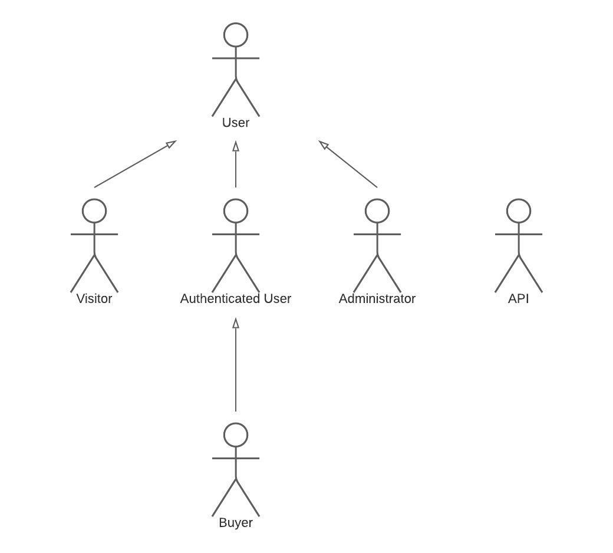
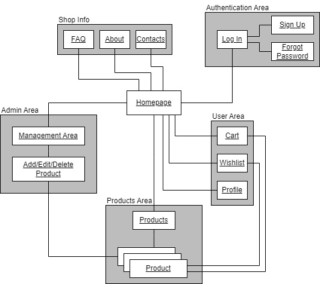
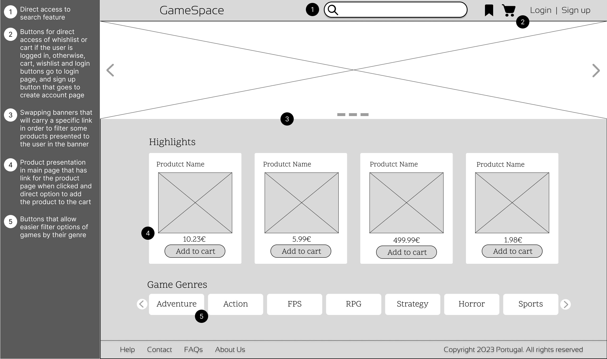
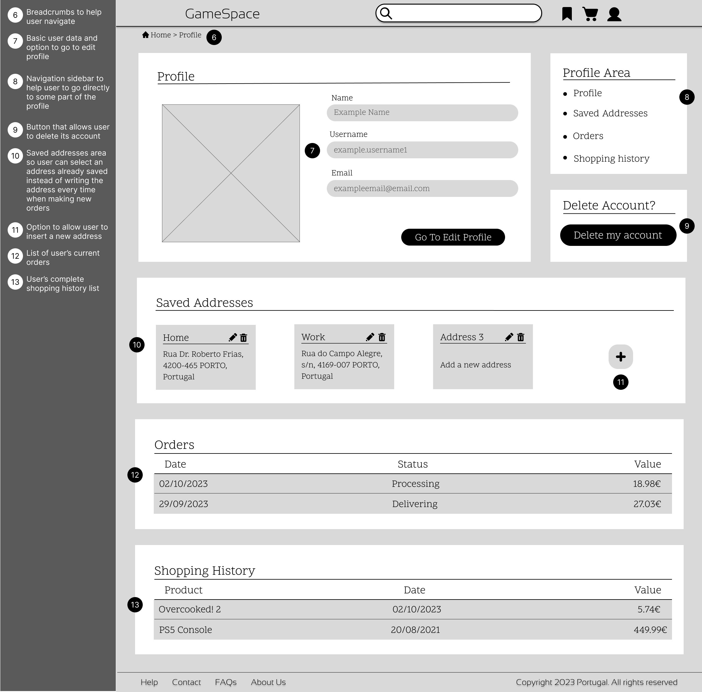
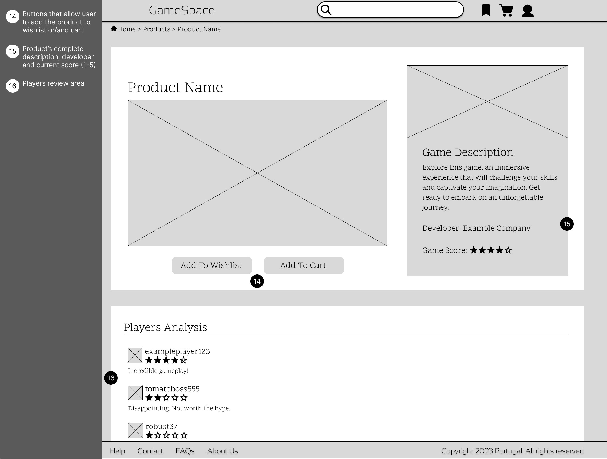

# ER: Requirements Specification Component

## A1: GameSpace

GameSpace is your gateway to the world of gaming, offering a convenient way to explore and acquire a wide variety of games across genres and game consoles, all in one place. In an era where gamers want something centralized, user-friendly, and personalized gaming experiences, we are here to provide just that.

Our platform offers a navigation system, allowing you to easily browse and discover games categorized by genre and platform, or simply filter them using the filter tool. Whether you are in a hurry for a specific title or just exploring new games, our search bar and filter tool will ensure that you find what you are looking for. Each game has its dedicated page, providing you with essential information and some valube able user reviews of your new wished game. Gain insights from other gamers and make informed decisions before adding games to your library.

We believe in making your gaming experience unique. Our recommendation engine analyzes your gaming preferences and past purchases to suggest some new titles that you might like. Regarding the payment method, user can add credits to his account, and once the user purchases its cart, it will be subtracted on his account.

Users will be distributed in three groups with different permissions: administrators, visitors and authenticated users. An administrator will have all the privileges of access and modification, such as update availbe able products and delete offensive reviews, however, this user won't be allowed to purchase or review any item. In addition, the administrator will manage users accounts, like block and unblock accounts. A visitor user will only be be able to navigate through the website, seeing all the content like products, reviews, and pages, without being be able of making purchases. Finally, an user can gain perks once done login authentication, being an authenticated user and he will have privileges not only to make purchases and review items but also to assemble lists and manage their personal information. Authenticated user become a Buyer once finish shopping. 

Never miss out on the bestsellers and your most-wanted titles! Add games to your wish list for future reference, and when you're sure of your choice, simply add them to your cart. Our user-friendly cart ensures a hassle-free checkout process.

## A2: Actors and User stories

This artefact contains the actors and their user stories of this system, with the purpose of showing the functionalities and requeriments that our application will have.

### 1. Actors

<figcaption align= "center">Figure 1: Actors</figcaption>

| Identifier | Description | 
| --- | --- |
| User | Generic user that has access to public information such as search and view items. |
| Visitor | Unauthenticated user that can register itself or sign-in the system. |
| Authenticated User | User that can make purchases, manage their personal information, log out of the account, add items to favorites. |
| Buyer | User that has made purchases. Can check their purchase history, track their order, review an item that they have bought. |
| Administrator | Authenticated user that is responsible for the management of products and users and supervisory and moderation functions, like delete offensive reviews. |
| API | External OAuth APIs that can be used to register or authenticate into the system. |

<figcaption align= "center">Table 1: Actors' descriptions</figcaption>

### 2. User Stories

#### 2.1. User

| Identifier | Name | Priority | Priority |
| --- | --- | --- | --- |
| US01 | Product Details | High | As a User, I want to be able to see the product details, so that I can see a detailed representation of it. |
| US02 | Search products | High | As a User, I want to be able to search for products, so that I can find what I'm looking for. |
| US03 | Browse Product Categories | Medium | As a User, I want to be able to view products from a selected category, so that I can explore all the products availbe able from that category. |
| US04 | Search by Filters | Medium | As a User, I want to be able to  filter with some specific properties, so that I can narrow down my search. |
| US05 | View Reviews | Medium | As a User, I want to be able to view a product's reviews, so that I can get a sense of the general opinion on it. |
| US06 | Home Page | Medium | As a User, I want to be able to have access to the home page, so that I can have a brief presentation of the website. |
| US07 | About Page | Medium | As a User, I want to be able to see an About page, so that I can see a description of the website and its creators. |
| US08 | FAQ Page | Medium | As a User, I want to be able to see a FAQ page, so that I can get quick answers to commom questions. |
| US09 | Consult Contacts | Medium | As a User, I want to be able to  access contacts, so that I can contact the platform owners.* |
| US10 | See User Profile | Medium | As a User, I want to be able to  view users' profiles, so that I can see other users reviews and information. |
| US11 | Search User Profile | Medium | As a User, I want to be able to  search user profiles, so that I can find specific users.
| US12 | Sorting options | Low | As a User, I want to be able to  sort with some specific properties, so that I can easily see shop items. |
| US13 | View Recommendations | Low | As a User, I want to be able to view recommended products, so that I can view products suitbe able for me. |

<figcaption align= "center">Table 2: User's user stories</figcaption>

#### 2.2. Visitor

| Identifier | Name | Priority | Description |
| --- | --- | --- | --- |
| US14 | Sign-in | High | As a Visitor, I want to be able to authenticate into the system, so that I can access privileged information. |
| US15 | Sign-up | High | As a Visitor, I want to be able to register myself into the system, so that I can authenticate myself into the system. |
| US16 | Recover password | Medium | As an Visitor, I want to be able to recover my password, so that I’m not locked out of my account if I forget it. |
| US17 | External API Sign-in | Low | As a Visitor, I want to be able to register a new account linked to my Google account, so that I can avoid to create a whole new account to use the platform.  |
| US18 | External API Sign-up | Low | As a Vistor, I want to be able to sign-in through my Google account, so that I can authenticate myself into the system. |

<figcaption align= "center">Table 3: Visitor's user stories</figcaption>

#### 2.3. Authenticated User

| Identifier | Name | Priority | Description |
| --- | --- | --- | --- |
| US19 | Add to Shopping Cart | High | As an Authenticated User, I want to be able to add products to the shopping cart, so that I can buy them later. |
| US20 | Manage Shopping Cart | High | As an Authenticated User, I want to be able to manage my shopping cart, so that I can decide what I want to buy. |
| US21 | Log out | High | As an Authenticated User, I want to be able to log in and out of my account, so that I can protect my personal information and ensure no unauthorized access to my account. |
| US22 | View profile | High | As an Authenticated User, I want to be able to view my profile, so that I can see my personal data |
| US23 | Edit profile | High | As an Authenticated User, I want to be able to edit my profile, so I can alter my personal data |
| US24 | Delete account | High | As an Authenticated User, I want to be able to delete my account, so that I can remove my personal data from the site when I don’t want to use it anymore |
| US25 | Add wishlist | Medium | As an Authenticated User, I want to be able to add products to my wishlist, so that I can keep track of products I’d like to buy. |
| US26 | View wishlist | Medium | As an Authenticated User, I want to be able to view my wishlist, so that I can see what products I have previously saved there. |
| US27 | Remove from wishlist | Medium | As an Authenticated User, I want to be able to remove products from my wishlist, so that I can stop keeping track of products I’m not interested in anymore. |
| US28 | Update password | Medium | As an Authenticated User, I want to be able to update my password, so that I can enhance the security of my account and protect it from unauthorized access. |
| US29 | Review voting | Medium | As an Authenticated User, I want to be able to vote on reviews, so that other users know which reviews are more useful. |
| US30 | View Notifications | Low | As an Authenticated User, I want to be able to view my notifications, so that I’m kept up to date about changes that might concern me. |
| US31 | Product price change | Low | As an Authenticated User, I want to be able to receive a notification if a product in my shopping cart or wish list changes price, so that I’m aware that the price of the product was altered |
| US32 | Product availability | Low | As an Authenticated User, I want to be able to receive a notification when a product in my cart or wish list is availbe able again, so that I can I order that product |

<figcaption align= "center">Table 4: Authenticated User's user stories</figcaption>

#### 2.4. Administrator

| Identifier | Name | Priority | Description |
| --- | --- | --- | --- |
| US33 | Unban Account | Medium | As an Admin, I want to be able to  unban a user that was previously banned, so that I can provide a second chance to a previously misbehaving user. |
| US34 | Manage Catalog | Medium | As an Admin, I want to be able to  add, edit and remove items from the shop's catalog, so that users get an updated list of the item's being sold. |
| US35 | Manage Item Category | Medium | As an Admin, I want to be able to  manage the category of an item, so that users may more easily find what they are looking for. | 
| US36 | Delete Review | Medium | As an Admin, I want to be able to  delete an item review, so that the platform is free from misinformation and inappropriateness. | 
| US37 | Ban Account | Medium | As an Admin, I want to be able to  ban a user's account (temporarily or permanently), so that i can punish misbehaving users. |
| US38 | Manage Stock | Medium | As an Admin, I want to be able to be be able manage the shop's stock, so that users are aware when an item is sold off. |
| US39 | View Users’ Purchase History | Medium | As an Admin, I want to be able to  view the users’ purchase history, so that I can check what the users are buying. |
| US40 | Manage Order Status | Medium | As an Admin, I want to be able to  manage the status of orders, so that I can monitor the sale.|
| US41 | Manage Item Description | Medium | As an Admin, I want to be able to be be able manage the descriptions of items, so that users get an accurate representation of what is being sold. |

<figcaption align= "center">Table 5: Administrator's user stories</figcaption>

#### 2.5. Buyer

| Identifier | Name | Priority | Description |
| --- | --- | --- | --- |
| US42 | Review a game | High | As a Buyer, I want to be able to write a review of a game that I have bought, so that other users can see what I thought of the game. |
| US43 | Give games a score | High | As a Buyer, I want to be able to rate a game from 1 to 5, so that other users have an idea of the quality of the game. |
| US44 | Delete a game score | High | As a Buyer, I want to be able to  delete the score I’ve given to a game, so that other users don’t see it. |
| US45 | Check purchase history | High | As a Buyer, I want to be able to view my purchase history, so that I can check my past purchases. |
| US46 | Delete a game review | High | As a Buyer, I want to be able to  delete a previous review I wrote about a game, so that other users can't read it. |
| US47 | Edit a game review | Medium | As a Buyer, I want to be able to  edit a review on a game that I bought, so that I can alter it in case I change my mind on the game. |
| US48 | Payment approval | Low | As a Buyer, I want to be able to receive a notification when a payment gets approved, so that I know that my payment process was successful. |
| US49 | Cancel order | Low | As a Buyer, I want to be able to  cancel an order, so that I can get my money back if I accidentally bought an item I don’t want and it hasn’t been delivered yet. |
| US50 | Change in order status | Low | As a Buyer, I want to be able to receive a notification about changes in the order processing stage, so that I know what my order status is. |
| US51 | Track order | Low | As a Buyer, I want to be able to track an order, so that I know the status of a purchased product. |
| US52 | Address options | Low | As a Buyer, I want to be able to choose which of my addresses my order is sent to, so that it is sent to the most convenient place for me. |

<figcaption align= "center">Table 6: Buyer's user stories</figcaption>

### 3. Supplementary Requirements

#### 3.1. Business rules 

| Identifier | Name | Description | 
| --- | --- | --- | 
| BR01 | Deleted item history | The description and statistics of an item (name, description, reviews, score, etc) must be maintained even if it was deleted from the store in order to keep the sales record. | 
| BR02 | Review Date | The review date of an item must be greater than the purchase date of the item by the user. |
| BR03 | Item score | All shop items have a score, a mean of all its user scores. | 
| BR04 | Deleted user history | An archive of a user's purchase history is maintained even if the user has deleted their account, in order to preserve data consistency outside the user themselves. | 
| BR05 | Order cancellation restriction | A non game order can only be canceled before it has been delivered. After being delivered, it is only possible to request a refund. | 
| BR06 | Game refunds | A game can be refunded at any time, independent from the date that it was bought and how many hours the user played the game, but the user will only receive 50% from the value that paid for that game. | 
| BR07 | Difference between user and admin accounts | Admin's accounts are independent of the users accounts, so admins cannot buy products. | 
| BR08 | Single review and score | An authenticated user can only make one review and one score per item acquired. |    
| BR09 | Review voting | A user can't vote on his own review. |

<figcaption align= "center">Table 7: Business rules </figcaption>

#### 3.2. Technical requirements

| Identifier | Name | Description |
| --- | --- | --- |
| TR01 | Availability | The system must be availbe able 99 percent of the time in each 24-hour period. |
| TR02 | Accessibility | The system must ensure that everyone can access and use the website, regardless of handicaps or browser of choice. |
| **TR03** | **Usability** | **The system should be simple and easy to use. The platform is meant for users of all ages and levels of technical knowledge, so ease of use is very important.** |
| **TR04** | **Performance** | **The system should have response times shorter than 2 s to ensure the user's attention. The system should be accessible without the need to install other software, adopting standard web technologies.** |
| **TR05** | **Web application** | **The system should be implemented as a web application with dynamic pages (HTML5, JavaScript, CSS3 and PHP). The system should be platform independent to allow for a wider user base.** |
| TR06 | Portability | The server-side system should work across multiple platforms (Linux, Mac OS, etc). |
| TR07 | Database | The PostgreSQL database management system must be used. |
| TR08 | Security | The system shall protect information from unauthorized access through the use of an authentication and verification system. |
| TR09 | Robustness | The system must be prepared to handle and continue operating when runtime errors occur. |
| TR10 | Scalability | The system must be prepared to deal with the growth in the number of users and their actions. |
| TR11 | Ethics | The system must respect the ethical principles in software development (for example, personal user details, or usage data, should not be collected nor shared without full acknowledgement and authorization from its owner). |

<figcaption align= "center">Table 8: Technical requirements</figcaption>

We chose these three requirements (TR03, TR04 and TR05) as the most important ones since we consider them to be the most important for the user's quality of life while using the site, for the reasons explained in their description: site responsiveness, intuitiveness and flexibility accross platforms.

#### 3.3. Restrictions

| Identifier | Name | Description |
| --- | --- | --- |
| C01 | Deadline | The system should be ready to be used at the end of the semester. |

<figcaption align= "center">Table 9: Restrictions</figcaption>

## A3: Information Architecture

This artefact presents an overview of the system and how it interacts from the viewpoint of the users.
It aims to help to identify and describe the user requirements, raise new ones, clarify the information hierarchy and show an early simulation of some of the main User Interfaces. This artefact includes a sitemap and three wireframes.

### 1. Site Map

<figcaption align= "center">Figure 2: Sitemap</figcaption>

### 2. Wireframes

**UI01: Main menu**

<figcaption align= "center">Figure 3: Main menu wireframe</figcaption>

**UI02: User profile**

<figcaption align= "center">Figure 4: User profile wireframe</figcaption>

**UI03: Product profile**

<figcaption align= "center">Figure 5: Product page wireframe</figcaption>

## Revision History

## GROUP23154, 03/10/2023

* Group member 1 João Brandão Alves, up202108670@fe.up.pt
* Group member 2 Eduardo Machado Teixeira de Sousa, up202103342@fe.up.pt
* Group member 3 Gonçalo Carvalho Marques, up202006874@fe.up.pt
* Group member 4 Carlos Daniel Santos Reis, up201805156@fc.up.pt (Editor)
