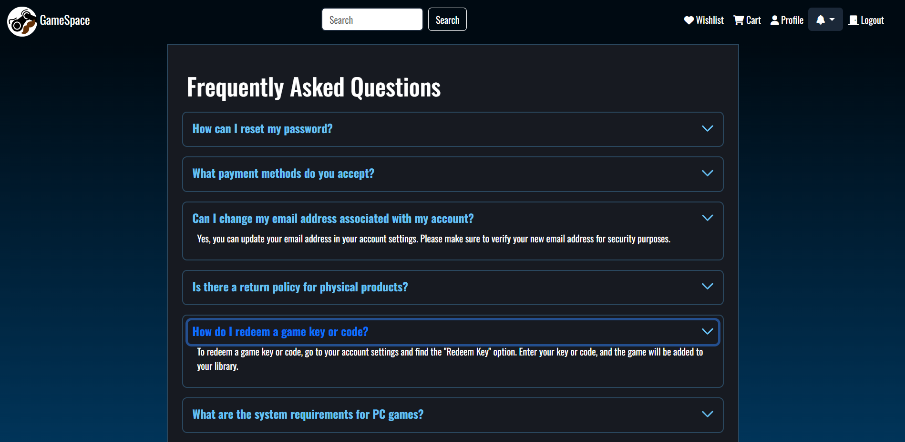
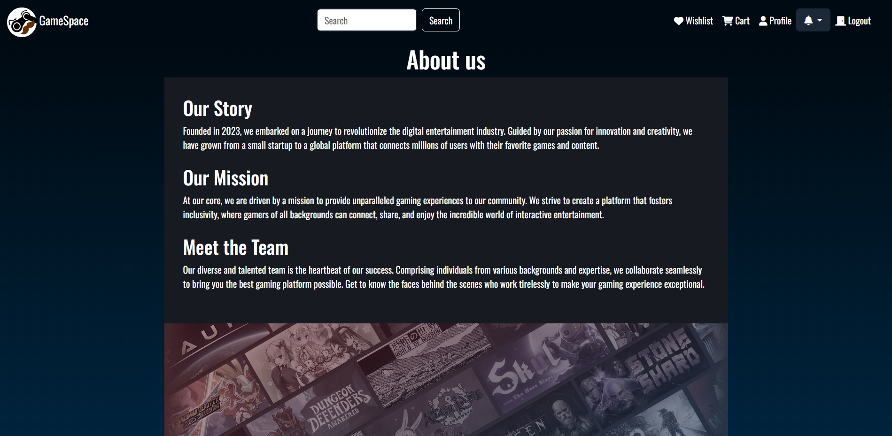
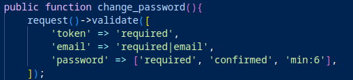
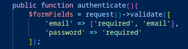
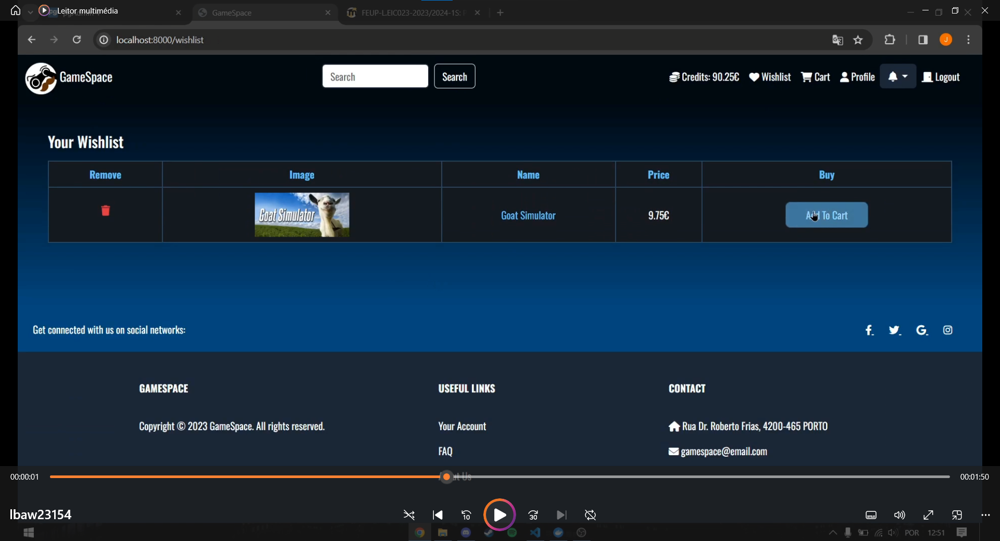

# PA: Product and Presentation

<p>GameSpace is your gateway to the world of gaming, offering a convenient way to explore and acquire a wide variety of games across genres and game consoles, all in one place. In an era where gamers want something centralized, user-friendly, and personalized gaming experiences, we are here to provide just that.
<p>Never miss out on the bestsellers and your most-wanted titles! Add games to your wishlist for future reference, and when you're sure of your choice, simply add them to your cart. Our user-friendly cart ensures a hassle-free checkout process.

## A9: Product

The GameSpace final product is the culmination of the comprehensive system designed in the preceding stages, using HTML, CSS, and JavaScript to build interactive web pages and is built using the Laravel Framework with PostgreSQL as a database, offering an all-in-one hub for gaming enthusiasts.

GameSpace's primary goal is to provide a seamless journey for game discovery, exploration, and purchase across various genres and consoles. This platform, ideal for all gamers, allows users to maintain a wishlist and features an user-friendly shopping cart for easy checkout. After registration and user profile verification, gamers can start their ultimate gaming experience with GameSpace.

### 1. Installation

The release with the final version of the source code in the group's Git repository is available [PA](https://git.fe.up.pt/lbaw/lbaw2324/lbaw23154/-/tags/EAP), in PA tag.

Full Docker command to launch the image available in the group's GitLab Container Registry using the production database:

```
docker run -it -p 8000:80 --name=lbaw23154 -e DB_DATABASE="23154" -e DB_SCHEMA="lbaw23154" -e DB_USERNAME="lbaw23154" -e DB_PASSWORD="xdcPCrFY" git.fe.up.pt:5050/lbaw/lbaw2324/lbaw23154 
```

### 2. Usage

URL to the product: http://lbaw23154.lbaw.fe.up.pt  

#### 2.1. Administration Credentials

| Email | Password |
| -------- | -------- |
| admin@test.com    | password |

#### 2.2. User Credentials

| Type          | Email  | Password |
| ------------- | --------- | -------- |
| User | test@test.com    | password |

#### 2.3. PayPal Credentials

| Type          | Email  | Password |
| ------------- | --------- | -------- |
| Client | sb-uxtjc28856733@personal.example.com    | sb493M)v |
| Business | sb-x062v28583591@business.example.com | E!4w]xZ7 |


### 3. Application Help

We have implemented the About Us and FAQ pages, links to which are found in the footer, to help the user navigate the site. Contacts are also visible in the footer.

In the FAQ page, we answer some recurring questions about how the website works along with its policies.



In the About Us page, we present some general information and trivia about our team, journey and goals.



We have implemented success and error flash messages after most actions that result in a redirect.


### 4. Input Validation

For backend input validation in our project, we leveraged the Illuminate\\Http\\Request, allowing us to utilize the "validate" function with various validation types. This capability was utilized to validate form inputs, such as those in the login/register form, and the edit user/group profile form, as demonstrated in the following examples:





As the front-end input validation we used javascript. For example, when the quantity of an item in the cart or when editing the stock of an item, invalid inputs are rolled back.

### 5. Check Accessibility and Usability

* [Accessibility:](/documents/Checklist%20de%20Acessibilidade%20-%20SAPO%20UX.pdf), 17/18
* [Usability:](/documents/Checklist%20de%20Usabilidade%20-%20SAPO%20UX.pdf), 24/28

### 6. HTML & CSS Validation

* [HTML home page:](/documents/Showing%20results%20for%20contents%20of%20text-input%20area%20-%20Nu%20Html%20Checker.pdf)  
* [CSS:](/documents/Resultados%20da%20validação%20CSS%20do%20W3C%20para%20TextArea%20(CSS%20nível%203%20+%20SVG).pdf)

### 7. Revisions to the Project

#### Database Schema
* Timestamps added to all tables: 'created_at' and 'updated_at'.
* Three attributes added to users table: 'image', 'remember_token' and 'banned'.
* Credits attribute for the user table is now an unsigned float.
* Two attributes added to addresses table: 'label' and 'deleted_at'.
* Two attributes added to products table: 'stock' and 'image2'. 
* One attribute removed from products table: 'hardware'.
* Two attributes added to purchases table: 'product_id' and 'quantity'.
* Removed purchase_product table.
* Updated all triggers that used the purchase_product table to now use the purchases table.
* New table for password reset tokens: 'password_reset_tokens'.
* New table for notifications: 'notifications'.

### 8. Implementation Details

#### 8.1. Libraries Used

* [Carbon](https://carbon.nesbot.com/), to convert dates saved like timestamp into a date in format "day/month/year"
* [Alpine.js](https://alpinejs.dev/), to have success/failure messages for a couple seconds and then disappear
* [Laravel-Paypal](https://github.com/srmklive/laravel-paypal), to implement a way to insert money into the user account

#### 8.2 User Stories

| US Identifier | Name    | Module | Priority                       | Team Members               | State  |
| ------------- | ------- | ------ | ------------------------------ | -------------------------- | ------ |
| US01 | Product Details |   M02 | High | **João Alves**, Gonçalo Marques | 100%| 
| US02 | Search products |   M02 | High | **Gonçalo Marques** | 100%| 
| US03 | Browse Product Categories | M02 | Medium | **João Alves**| 100% |
| US04 | Search by Filters | M02 | Medium | - | 0% |
| US05 | View Reviews | M03 | Medium | **Gonçalo Marques**, João Alves | 100% |
| US06 | Home Page | M05 | Medium | **João Alves** | 100% |
| US07 | About Page | M05 | Medium | **João Alves**| 100% |
| US08 | FAQ Page | M05 | Medium | **João Alves**| 100% |
| US09 | Consult Contacts | M05 | Medium | **João Alves**| 100% |
| US10 | See User Profile | M01 | Medium | **Eduardo Sousa**, João Alves | 100% |
| US11 | Search User Profile | M01 | Medium | - | 0% |
| US12 | Sorting Options | M02 | Low | - | 0% |
| US13 | View Recommendations | M02 | Low | - | 0% |
| US14 | Sign-in | M01 | High | **Gonçalo Marques** | 100% |
| US15 | Sign-up | M01 | High | **Gonçalo Marques** | 100% |
| US16 | Recover Password | M01 | Medium | **Eduardo Sousa**, Gonçalo Marques | 100% |
| US17 | External API Sign-in | M01 | Low | - | 0% |
| US18 | External API Sign-up | M01 | Low | - | 0% |
| US19 | Add to Shopping Cart |  M04 | High | **Gonçalo Marques**, João Alves | 100%
| US20 | Manage Shopping Cart | M04 | High  | **Gonçalo Marques**, João Alves| 100% |
| US21 | Log out |   M01 | High | **Gonçalo Marques** | 100% |
| US22 | View profile |  M01  | High | **Eduardo Sousa**, Gonçalo Marques, João Alves | 100% |
| US23 | Edit profile |  M01 | High | **Gonçalo Marques**, João Alves, Eduardo Sousa | 100% |
| US24 | Delete account |  M01 | High | **Eduardo Sousa**, Gonçalo Marques | 100% |
| US25 | Add to Wishlist | M03 | Medium |  **Gonçalo Marques**, João Alves | 100% |
| US26 | View Wishlist | M03 | Medium |  **João Alves** | 100% |
| US27 | Remove from  Wishlist | M03 | Medium | **João Alves** | 100% |
| US28 | Update password | M01 | Medium | **Eduardo Sousa**, Gonçalo Marques | 100% |
| US29 | Review Voting | M03 | Medium | **Eduardo Sousa**, Gonçalo Marques | 100% |
| US30 | View Notifications | M01 | Medium | **Gonçalo Marques**, João Alves | 100% |
| US31 | Product Price Change | M01 | Low | **Gonçalo Marques** | 100% |
| US32 | Product Availability | M02 | Low | - | 0% |
| US33 | Unban Account | M06 | Medium |  **Gonçalo Marques** | 100% |
| US34 | Manage Catalog | M06 | Medium |  **Gonçalo Marques** | 100% |
| US35 | Manage Item Category | M06 | Medium |  **Gonçalo Marques** | 100% |
| US36 | Delete Review | M06 | Medium | **Gonçalo Marques** | 100% |
| US37 | Ban Account | M06 | Medium | **Gonçalo Marques** | 100% |
| US38 | Manage Stock | M06 | Medium | **Gonçalo Marques** | 100% |
| US39 | View Users' Purchase History | M06 | Medium | **João Alves**  | 100% |
| US40 | Manage Order Status | M06 | Medium | **Gonçalo Marques** | 100% |
| US41 | Manage Item Description | M06 | Medium | **Gonçalo Marques** | 100% |
| US42 | Review a game | M03 | High | **Gonçalo Marques**, João Alves | 100% | 
| US43 | Give games a score |   M02 | High | **Gonçalo Marques**, João Alves | 100% |
| US44 | Delete a game score |  M02  | High | **Gonçalo Marques** | 100% |
| US45 | Check purchase history |  M01 | High | **João Alves** | 100% |
| US46 | Delete a game review |  M02 | High | **Gonçalo Marques** | 100% |
| US47 | Edit Game Review | M03 | Medium | - | 0% |
| US48 | Payment approval | M04 | Low | **Gonçalo Marques**, João Alves | 100% |
| US49 | Cancel Order | M01 | Low | - | 0% |
| US50 | Change in Order Status | M01 | Low |  **Gonçalo Marques** | 100% |
| US51 | Track Order | M01 | Low |  **Gonçalo Marques** | 100% |
| US52 | Address Options | M01 | Low | **Eduardo Sousa**, Gonçalo Marques | 100% |
---

## A10: Presentation

### 1. Product presentation
GameSpace is a new videogame store! We have a varied selection of products across many different genres and platforms. You can buy credit through PayPal and exchange it for whatever you put into your shopping cart. You can also review any product in our selection and much more.

GameSpace was developed using a combination of HTML5, JavaScript, and CSS. The user interface was enhanced with the Bootstrap framework, while the back-end and page content were implemented using the Laravel framework, which utilizes PHP. The platform also incorporates an adaptive design. For further details, refer to the information provided on the static pages and if your questions persist, feel free to contact us through the provided contacts.

- URL to the product: http://lbaw23154.lbaw.fe.up.pt  

### 2. Video presentation


- URL to the video: https://www.youtube.com/watch?v=KAYF-B0ljUQ&ab_channel=Jo%C3%A3oAlves


## GROUP23154, 19/12/2023

* Group member 1 João Brandão Alves, up202108670@fe.up.pt
* Group member 2 Eduardo Machado Teixeira de Sousa, up202103342@fe.up.pt (Editor)
* Group member 3 Gonçalo Carvalho Marques, up202006874@fe.up.pt

